# Kovid Goyal 👋

## Principal Developer of calibre and kitty

I am an open-source software engineer and principal maintainer of several widely utilized software projects, specializing in high-performance desktop applications and advanced tooling for power users. My professional expertise encompasses systems engineering, GPU-accelerated interfaces, and quantum computing research.

---

## 🚀 Core Projects

### Project	Description	Technologies

- **kitty**	GPU-accelerated, keyboard-driven terminal emulator providing high performance and extensive functionality.	Python, C, OpenGL

- **calibre**	Comprehensive e-book management and conversion suite, widely adopted globally.	Python, Qt, C++

- **html5-parser**	High-performance HTML5 parsing library for Python.	C, Python

- **rapydscript-ng**	Transpiler converting a Python-like syntax into JavaScript for robust application development.	JavaScript

---

##?📊 GitHub Contributions

  
  

  
  

  
  

---

## 🎓 Academic Background

- Doctorate in *Quantum Computing from the **California Institute of Technology***, with a research emphasis on fault-tolerant quantum architectures.

- Subsequently **transitioned to full-time *open-source* software development**, maintaining tools utilized by millions worldwide.

- Professional principles include **efficiency, correctness, and automation**, favoring **robust and maintainable designs** over expedient solutions.

---

## 💬 Professional Approach and Philosophy

- Prioritize **system reliability and maintainability** over superficial expediency.

- Employ **scalable and sustainable software design** patterns.

- Advocate for **keyboard-centric interfaces** to maximize productivity.

- Ensure **robustness and correctness** are integral to all software development efforts.

- These principles guide both technical execution and community engagement.

---

## 🔧 Technical Skills and Expertise

  
  
  
  
  
  

---

## 📬 Contact and Support

- **Email**: Refer to the top lines of calibre or kitty source files (preferred method).

- **Issues and Feedback**: Utilize the official GitHub issue trackers.

- **Support**: Contributions may be made via the official calibre donation page.

---

## ✨ Closing Statement

Open-source software development is a collaborative endeavor across diverse geographies and cultures. The objective is to provide tools that respect user expertise, adhere to rigorous standards, and meet real-world requirements. Appreciation is extended to all contributors whose efforts enhance the projects and the broader community.

---
